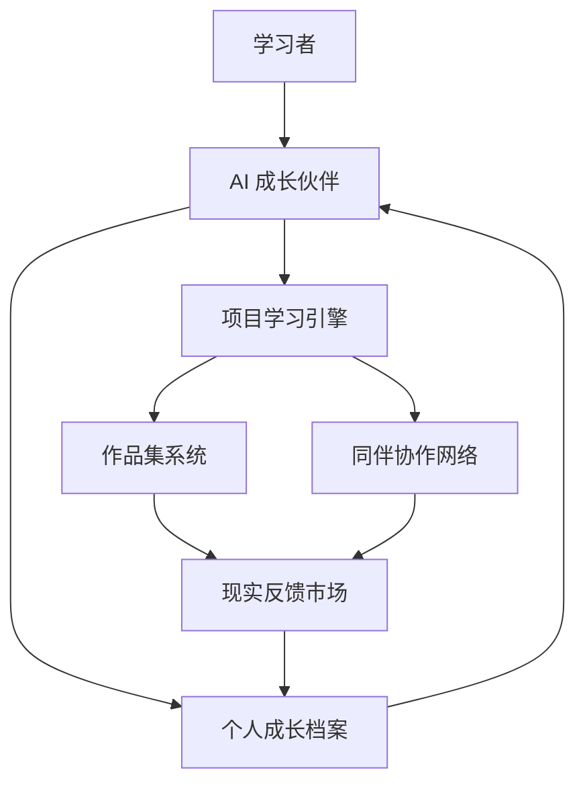

# 教育系统架构

完整人格教育操作系统由六个核心模块组成：

1. AI 成长伙伴
2. 项目学习引擎
3. 成长档案
4. 作品集系统
5. 同伴协作网络
6. 现实反馈市场

## 总体架构

## 1. AI 成长伙伴

AI 成长伙伴不是答题工具，而是长期伴随型教育代理。

### 职责

- 理解学习者的兴趣、能力、节奏和状态
- 帮助发现问题
- 推荐学习路径
- 解释必要知识
- 拆解项目任务
- 追踪执行进度
- 陪伴复盘
- 维护成长档案
- 生成阶段报告

### 禁止替代的部分

- 不能替代真实体验
- 不能替代身体训练
- 不能替代人际关系
- 不能替代责任承担
- 不能把成长简化成效率优化

## 2. 项目学习引擎

项目学习引擎是新教育的主课堂。

项目必须同时满足四个条件：

- 有真实问题
- 有明确产出
- 有外部反馈
- 有复盘记录

项目可以来自：

- 个人兴趣
- 家庭任务
- 社区问题
- 企业需求
- 科研探索
- 艺术创作
- 公益服务
- 技术产品

## 3. 成长档案

成长档案是学习者的长期人格地图。

它记录：

- 兴趣变化
- 问题清单
- 项目经历
- 作品记录
- 能力曲线
- 情绪与生命状态
- 合作评价
- 失败复盘
- 重要选择
- 成长叙事

成长档案的目的不是监控人，而是帮助人看见自己。

## 4. 作品集系统

作品集是替代文凭的核心载体。

一个人的作品集应该包括：

- 作品本身
- 创作过程
- 版本迭代
- 使用数据
- 用户反馈
- 同伴评价
- 专家点评
- 自我复盘

作品集比考试更接近真实能力，因为它能显示一个人如何在长期、不确定和复杂的环境中行动。

## 5. 同伴协作网络

同伴网络替代传统班级。

它不是按年龄强制分组，而是按项目、兴趣、能力阶段和成长目标动态组队。

### 组织形式

- 3 到 5 人项目小组
- 8 到 12 人成长小队
- 30 到 50 人主题社群
- 跨城市、跨年龄、跨领域协作网络

### 同伴网络的价值

- 提供真实协作经验
- 提供情绪支持
- 提供同辈压力
- 提供展示场景
- 提供长期关系

## 6. 现实反馈市场

现实反馈市场连接学习者与真实世界。

反馈来源包括：

- 用户
- 客户
- 观众
- 社区成员
- 企业
- 研究者
- 创作者
- 公益组织
- 家庭成员
- 专业导师

现实反馈不是为了打击人，而是让学习者尽早理解：世界不是按标准答案运行的，世界会用真实需求、成本、注意力和信任回应你。

## 系统中的成人角色

旧系统中“老师”这个单一角色会被拆分：

| 角色 | 主要职责 |
| --- | --- |
| AI 成长伙伴 | 日常陪伴、知识解释、路径规划、复盘 |
| 项目导师 | 帮助项目落地，提供经验判断 |
| 人格教练 | 关注情绪、习惯、关系和生命状态 |
| 领域专家 | 在专业节点提供高质量判断 |
| 社群维护者 | 维护同伴网络秩序和安全 |
| 真实反馈者 | 对作品、服务或行动给出真实回应 |

老师不是消失为零，而是不再作为教育系统的中心权威存在。

