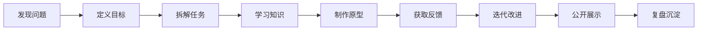

# 项目制学习引擎

项目是完整人格教育的主学习单元。

一个项目不是作业。作业服务于标准答案，项目服务于真实创造。

## 项目定义

一个合格项目必须包含：

1. 一个真实问题
2. 一个明确产出
3. 一组需要调用的知识和能力
4. 一个执行周期
5. 一个外部反馈对象
6. 一次复盘

## 项目生命周期

## 项目等级

### L1 观察项目

适合低年龄或初学者。

目标是训练观察、提问和表达。

例子：

- 记录一棵树 30 天的变化
- 采访三位老人关于童年的记忆
- 观察家里一周的用水情况
- 做一份社区声音地图

### L2 制作项目

目标是把想法做成可见作品。

例子：

- 做一本小书
- 做一个家庭收纳工具
- 拍一支纪录短片
- 设计一个桌游
- 制作一个简单网页

### L3 服务项目

目标是为真实对象提供价值。

例子：

- 为社区设计垃圾分类提示系统
- 给本地小店做菜单优化
- 组织一次亲子阅读活动
- 为同伴制作学习工具

### L4 研究项目

目标是对复杂问题进行调查、建模和表达。

例子：

- 为什么某个社区空间没人使用
- 青少年为什么不愿意运动
- AI 如何改变一个小行业
- 一个城市街区的商业变化

### L5 创业或社会创新项目

目标是进入真实交易、组织和社会影响。

例子：

- 做一个小型付费产品
- 运营一个主题社群
- 发起一个公益行动
- 设计一个可持续服务模型

## 项目中的知识调用

传统教育是先学知识，再等待未来使用。

项目制教育是先遇到问题，再调用知识。

例子：做一个“小区雨水收集系统”。

会自然调用：

- 数学测量
- 物理流体
- 生态知识
- 预算计算
- 访谈沟通
- 图纸表达
- 写作汇报
- 公共协商
- 项目管理

## 项目导师提示词

每个项目开始前，AI 成长伙伴需要问：

1. 你真正想解决的问题是什么？
2. 谁会从这个项目中受益？
3. 最小可交付成果是什么？
4. 你需要学习哪些知识？
5. 你需要谁的帮助？
6. 你打算如何获得真实反馈？
7. 你如何知道这个项目完成了？

## 项目复盘模板

每个项目结束后必须沉淀：

- 我最初的问题是什么？
- 我最终做出了什么？
- 过程中最大的困难是什么？
- 我如何解决或绕过困难？
- 哪些知识真正派上了用场？
- 谁给了我关键反馈？
- 我的下一版会怎么改？
- 这个项目让我更了解自己哪一点？

## 项目库初版分类

### 好奇心项目

- 追踪一个自然现象
- 研究一个城市细节
- 采访一个陌生职业
- 复原一个历史事件

### 经验项目

- 做一次真实销售
- 给真实用户提供服务
- 组织一次活动
- 完成一次预算有限的制作

### 生命力项目

- 建立 30 天运动计划
- 做一次自然徒步记录
- 设计个人睡眠改善实验
- 建立情绪观察日志

### 专注力项目

- 写一本 30 页小书
- 做一个 6 周产品原型
- 学会一首完整乐曲
- 完成一次长期研究报告

### 想象力项目

- 设计未来城市的一角
- 改写一个经典故事
- 做一套虚构产品设定
- 用三种材料重做一个日常物品

### 合作能力项目

- 三人共创一个展览
- 组织一次社区服务
- 做一款多人桌游
- 和异龄伙伴完成一次研究

