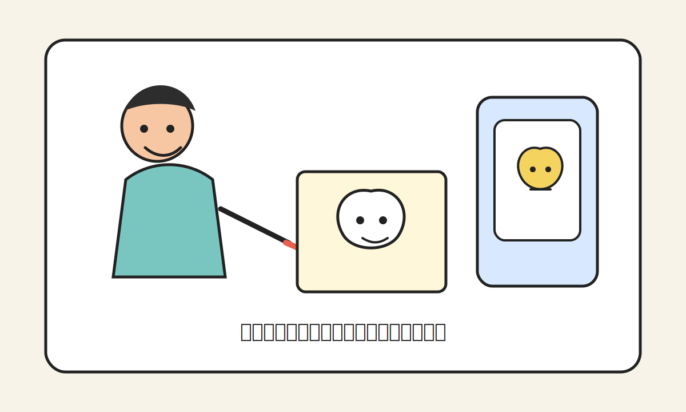
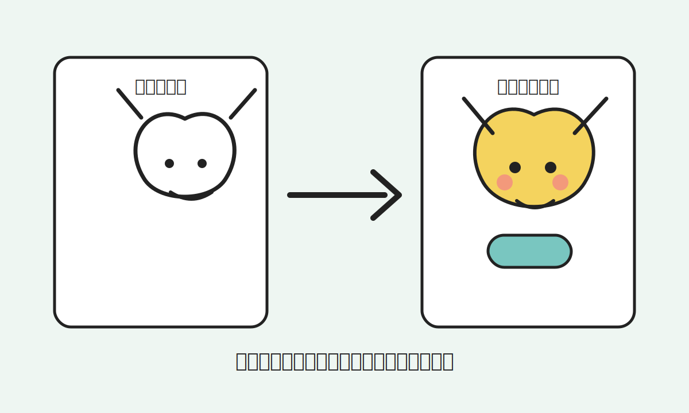
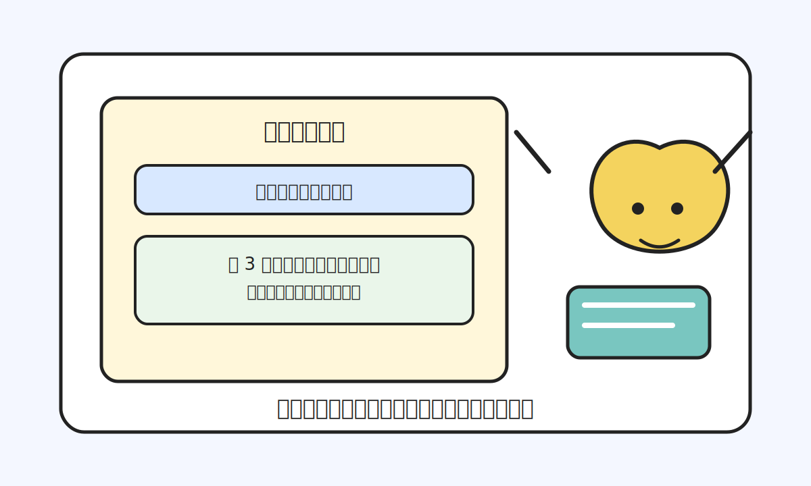
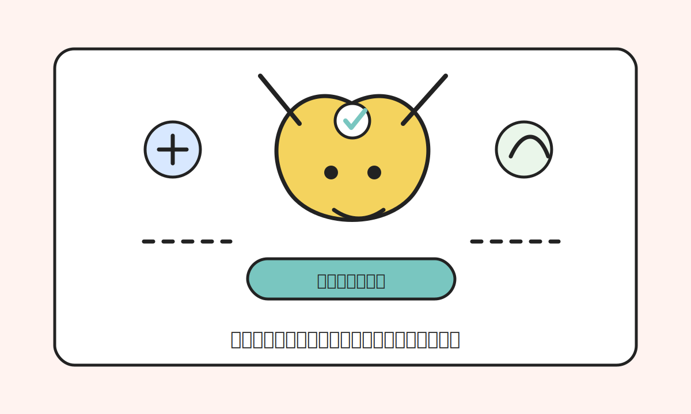
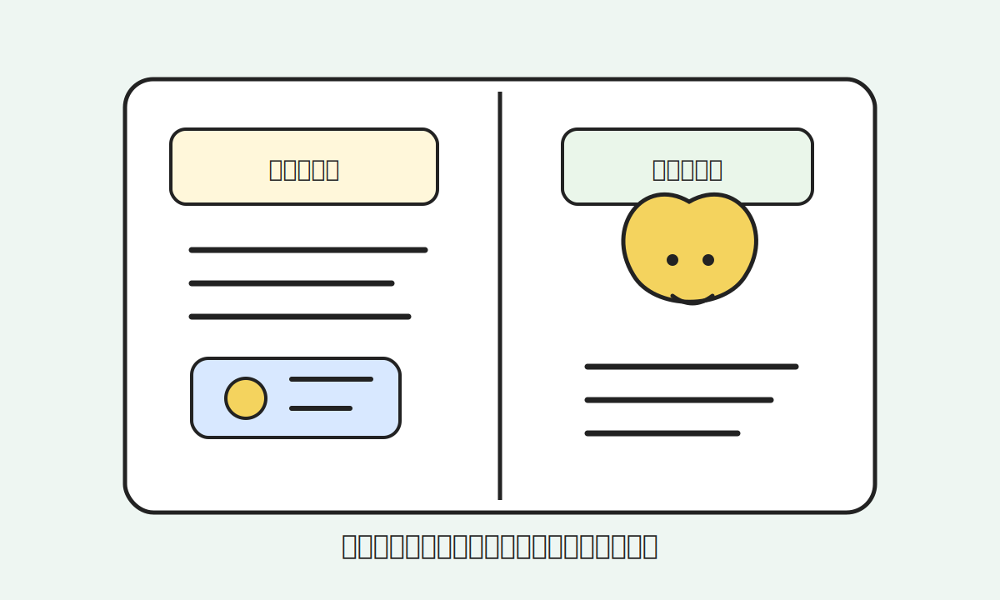
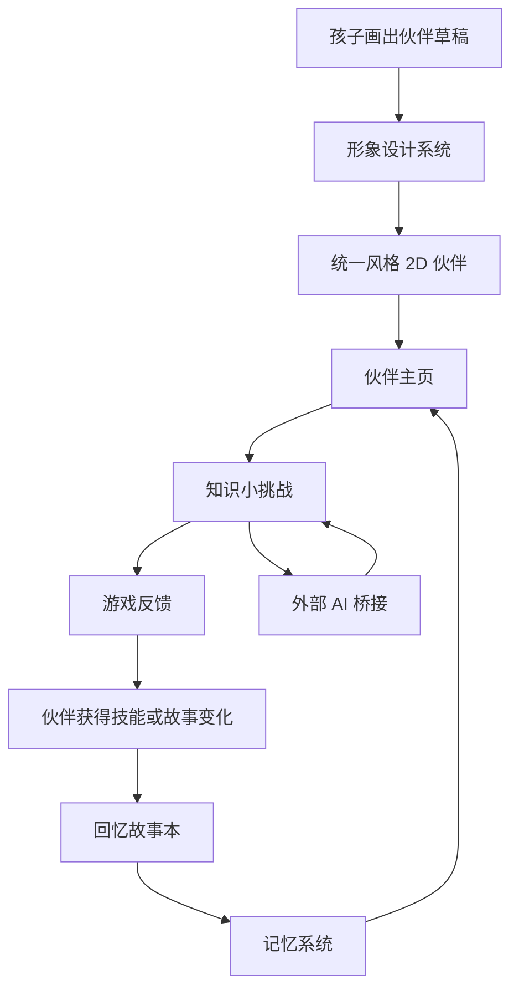
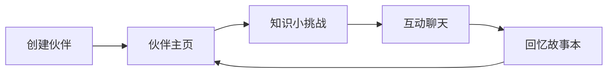

# 小小冒险伙伴：对外沟通稿

这是一份给潜在协作者、设计师、工程师、内容创作者、家长和早期支持者看的说明。

它不试图一次讲完整个未来教育系统，只回答四个问题：

1. 现在教育的痛点是什么？
2. 我认为未来教育会变成什么样？
3. 这个产品准备以什么形式进入孩子成长过程？
4. 我现在需要哪些外部资源一起把它做出来？

## 一句话说明

我正在做一个儿童 AI 伙伴 Demo：孩子画出自己的伙伴，系统把它变成统一风格的卡通形象，并通过知识挑战、互动聊天、游戏反馈和回忆故事，让这个伙伴陪孩子一起成长。

当前阶段不是做学校，不是做网课，不是做题库，也不是做完整教育平台。

我先做一个很小的原型：**AI 伙伴生成 + 知识挑战 + 成长故事**。

## 一、现在教育的痛点是什么？

### Q：为什么要重新思考教育？

A：因为 AI 正在让知识获取变得越来越便宜。

过去，教育很大一部分价值来自“老师讲知识、学生记知识、考试验证知识”。但未来，公共知识和很多经验知识都会被 AI 低成本调用。一个孩子想知道一个概念、一个公式、一个历史事件、一个科学现象，AI 都可以很快解释。

真正的问题会变成：

- 孩子有没有好奇心？
- 孩子会不会主动提问？
- 孩子能不能把知识用到真实生活里？
- 孩子能不能持续行动？
- 孩子能不能创造作品？
- 孩子能不能和别人合作？
- 孩子有没有稳定、完整、有生命力的自我？

### Q：传统教育最核心的痛点是什么？

A：它太容易把孩子训练成“适应考试的人”，而不是“完整生长的人”。

具体痛点包括：

- 重知识输入，轻真实体验
- 重标准答案，轻主动提问
- 重分数排名，轻人格成长
- 重统一进度，轻个体节奏
- 重外部评价，轻自我理解
- 重课堂和作业，轻生活、创造和关系

### Q：AI 出现以后，这个痛点会更严重还是更轻？

A：两种可能都有。

如果只是把 AI 用来讲课、刷题、批改作业，那它会让旧教育更高效，也会让孩子更早进入新的绩效系统。

但如果 AI 被设计成孩子的长期成长伙伴，它也可能把教育从“知识灌输”转向“陪伴孩子探索世界”。

关键不在 AI 本身，而在产品怎么设计。

## 二、未来教育可能是什么样？

### Q：如果知识变得便宜，未来人与人之间的差距是什么？

A：差距会从“知道多少”转向“如何成为一个完整的人”。

我目前把未来更重要的能力归纳为六类：

- 好奇心
- 经验
- 生命力
- 专注力
- 想象力
- 合作能力

这些能力不是靠刷题直接长出来的，它们需要长期陪伴、真实行动、失败复盘、作品创造和关系互动。

### Q：未来教育不再是什么？

A：它不应该只是：

- 网课
- 题库
- 学习机
- 标准课程表
- 新的分数排名
- 用 AI 包装的应试系统

### Q：未来教育更像什么？

A：更像一个孩子长期拥有的成长伙伴系统。

它会陪孩子：

- 发现问题
- 学一点需要的知识
- 做一个小挑战
- 记录自己的发现
- 形成一个故事
- 慢慢看见自己在变化

教育不只是“我学会了什么”，也包括“我经历了什么，我创造了什么，我和谁产生了连接，我怎么理解自己”。

## 三、这个产品准备以什么形式出现？

### Q：这个产品不是网课，那它是什么？

A：它是一个儿童 AI 伙伴产品的早期原型。

它的第一版非常小：

1. 孩子画一个伙伴
2. 系统生成统一风格的 2D 卡通形象
3. 孩子和伙伴互动
4. 系统给出一个知识小挑战
5. 孩子完成后，伙伴获得变化
6. 系统把这次经历记录成一页回忆故事

### Q：为什么要让孩子自己画伙伴？

A：因为孩子需要感觉“这是我创造出来的伙伴”。

如果系统直接发一个标准角色，孩子和它之间的关系会弱很多。孩子亲手画出来，再由系统变成更精致的统一风格角色，这个过程本身就是情感连接的开始。

### Q：为什么要有游戏系统？

A：因为孩子需要愿意回来。

但这个游戏系统不是为了让孩子刷数值，也不是为了排名。它只做轻量反馈：

- 伙伴多了一个表情
- 伙伴学会一个技能
- 伙伴房间多了一个小物件
- 伙伴的故事多了一页

孩子看到的不是分数，而是“我的伙伴因为我做过的事发生了变化”。

### Q：为什么要有知识系统？

A：因为第一阶段需要让家长看懂产品价值。

家长可能还没有意识到未来调用知识会越来越便宜，所以知识系统是一个现实入口。它告诉家长：这不是陪玩，也不是普通聊天，它确实能帮助孩子学一点东西。

但知识在这里不是题库，而是变成伙伴技能、故事变化和小挑战。

### Q：为什么要有记忆系统？

A：因为没有记忆，就没有长期陪伴。

孩子今天说喜欢声音，明天伙伴应该还记得。孩子完成过一次挑战，系统应该把它放进回忆故事本。长期来看，孩子不是在使用一个工具，而是在和一个逐渐了解自己的伙伴相处。

### Q：为什么要桥接豆包、DeepSeek 等国内大模型？

A：因为我现在是个人开发者，不能一开始就自建模型和硬件。

第一版可以先做低成本桥接：

- 系统生成提示词
- 用户复制到豆包、DeepSeek、Kimi、通义等工具
- 外部模型返回结果
- 用户粘贴回本系统
- 本系统把结果转成伙伴语言、挑战和故事

后续如果 Demo 成立，再接正式 API。

## 四、产品结构图

## 五、第一版页面图

## 六、当前只做什么？

第一版只做 5 个页面：

1. 创建伙伴
2. 伙伴主页
3. 知识小挑战
4. 互动聊天
5. 回忆故事本

第一版只做 6 个系统：

1. 形象设计系统
2. 知识系统
3. 成长系统
4. 游戏系统
5. 记忆系统
6. 硬件桥接系统

## 七、当前不做什么？

为了保证能落地，第一版明确不做：

- 不做原生 App
- 不做真实 3D 自动生成
- 不做复杂骨骼绑定
- 不做完整语音包
- 不做实体硬件
- 不做账号系统
- 不做支付系统
- 不做家长后台
- 不做公开作品集
- 不做数字身份绑定
- 不做真实儿童数据采集
- 不做学校替代方案

## 八、我现在需要哪些人协助？

### 1. 产品/UX 协作者

需要帮我把 5 个页面流程画清楚。

产出：

- 页面流程图
- 低保真线框图
- 页面字段清单

### 2. 视觉/插画协作者

需要帮我定义伙伴的统一美术风格。

产出：

- 美术风格说明
- 参考图
- 标准角色样例
- 禁止风格示例

### 3. AI 绘图提示词协作者

需要帮我把孩子草稿转成统一风格的 2D 伙伴图。

产出：

- 主提示词
- 负面提示词
- 角色一致性提示词
- 测试案例

### 4. 前端协作者

需要帮我做一个能本地运行的 Web Demo。

产出：

- 前端代码
- 本地存储
- 示例数据
- 5 个页面

### 5. 教育内容协作者

需要帮我设计第一批知识小挑战。

产出：

- 20 个知识挑战模板
- 每个挑战包括知识解释、小问题、小行动、伙伴变化

### 6. 游戏策划协作者

需要帮我设计轻量伙伴成长反馈。

产出：

- 技能命名规则
- 道具或技能列表
- 故事变化模板
- 完成挑战后的反馈机制

### 7. Prompt/模型桥接协作者

需要帮我设计能复制到豆包、DeepSeek 等工具里的提示词。

产出：

- 知识解释提示词
- 挑战生成提示词
- 伙伴故事改写提示词
- JSON 输出格式

### 8. 法律与知识产权协作者

需要帮我保护这个项目的早期知识产权和协作边界。

产出：

- 早期协作者协议草案
- 知识产权归属说明
- 保密与公开边界说明
- 投稿/交付成果授权条款
- 对外发布前的风险提示

我尤其希望保护：

- 项目概念
- 产品命名
- 角色设定
- 美术风格
- 开发文档
- 任务文档
- 提示词
- 代码和内容模板

## 九、配图建议

当前已配 5 张概念图，放在 `assets/` 目录：

- `assets/01-child-draws-companion.svg`
- `assets/02-sketch-to-companion.svg`
- `assets/03-knowledge-challenge.svg`
- `assets/04-companion-evolves.svg`
- `assets/05-memory-storybook.svg`

如果后续要做成更精美的图文介绍，可以请视觉设计师基于这 5 张概念图重绘：

### 图 1：孩子画伙伴

画面：一个孩子在纸上画出一个简单卡通形象，旁边是手机或电脑屏幕。

说明：伙伴不是系统发的，而是孩子自己创造的。

### 图 2：草稿变成 2D 伙伴

画面：左边是孩子的手绘草稿，右边是统一风格的精致 2D 卡通伙伴。

说明：系统把孩子的想象变成可互动的数字伙伴。

### 图 3：知识挑战

画面：伙伴拿着一本小书或工具，屏幕上出现一个 5 分钟小挑战。

说明：知识不是题库，而是让伙伴获得变化的入口。

### 图 4：伙伴变化

画面：伙伴获得新表情、新道具或新技能。

说明：孩子完成挑战后，伙伴的故事发生变化。

### 图 5：回忆故事本

画面：一本数字故事本，记录“今天学了什么、做了什么、伙伴发生了什么”。

说明：成长不是分数，而是一页页属于孩子和伙伴的故事。

## 十、对外一句话

我正在做一个儿童 AI 伙伴原型：孩子画出自己的伙伴，通过知识挑战和互动，让伙伴产生故事变化。它不是网课，不是题库，也不是普通聊天，而是一个把孩子的想象、学习和成长记录连接起来的小产品。
